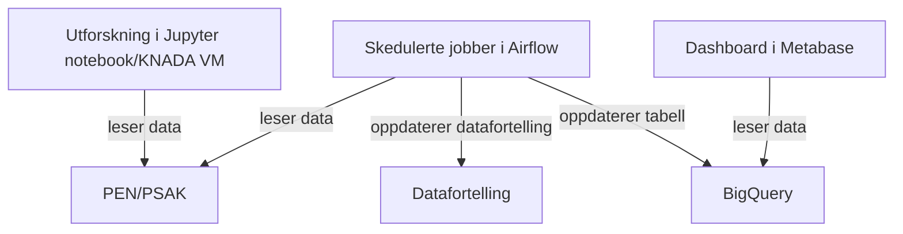

# pensjon-data-analyse
Dette repoet brukes til versjonskontroll av airflowjobber og en mengde ad-hoc innsiktsarbeid i PO Pensjon. Sistnevnte består hovedsakelig av jupyter notebooks og sql-spørringer mot PEN-databasen. Koden er beregnet på å kjøre i KNADA (se [docs.knada.io](https://docs.knada.io)). 

Dersom en airflowjobb feiler vil det sendes en melding til slack på kanalen #pensak-airflow-alerts.

# Typisk dataflyt

## Ordliste
- KNADA: En samling verktøy med tilgang til onprem-ressurser. Hovedbestanddelene er jupyterhub/VM og airflow.
- Dataprodukt: En tabell i BigQuery som er registrert på datamarkedsplassen
- Datafortelling: En rapport som er laget med quarto eller datastory og publisert på datamarkedsplassen
- Quarto: Verktøy for å kompilere en .html-fil (datafortelling) eller andre typer filer fra en jupyter notebook
- Datastory: Deprecated verktøy for å publisere datafortellinger. 
- Airflow: Verktøy for å skedulere jobber. Brukes til å oppdatere dataprodukter og datafortellinger. 
- Jupyter notebook: En interaktiv notebook som kan inneholde kode, tekst og bilder. Brukes til å utforske data og lage datafortellinger.

Alt i ordlista er bedre dokumentert i [nada sin dokumentasjon](https://docs.knada.io).

## Nødvendige tilganger
### Airflow
Hemmeligheter for airflowjobbene i knada-namespacet `pensjon-saksbehandling` lagres i tilhørende secret i Google Secret Manager. Lenke finnes i [knorten](https://knorten.knada.io). Servicebrukeren har automatisk tilgang til denne secreten, men den må leses ekspisitt inn i minnet for hver jobb. Nødvendige hemmeligheter er i skrivende stund følgende:
- Upersonlig brukernavn (`pen-airflow`) og passord med tilgang til prod-kopi av PEN-databasen. Ligger i vault. Merk at denne brukeren kun har tilgang til tabellene den allerede spør mot. For tilgang til flere tabeller, ta kontakt med db-teamet.
- Upersonlig brukernavn (`pensjon-psak-static-readonly`) og passord til psak-databasen (postgres). Ligger i vault.
- Teamtoken i datamarkedsplassen for pensjon-saksbehandling. Hentes fra [datamarkedsplassen](https://data.intern.nav.no/).

### Notebooks/VM
For utforskning i notebook/VM skal det brukes personlige versjoner av brukernavn og passord. Disse skal lagres i din personlige hemmelighet som kan opprettes fra [knorten](https://knorten.knada.io). For å få tilgang til denne hemmeligheten må du kjøre `gcloud auth login --update-adc`.

### BigQuery
Flere av jobbene kommuniserer med BigQuery og trenger derfor tilgang til å lese og/eller skrive til tabeller i BigQuery. Servicebrukeren til teamet trenger følgende roller:
- `BigQuery Data Viewer` på hver tabell den leser fra
- `BigQuery Data Editor` på hver tabell den skriver til
- `BigQuery Job User` i prosjektet hvor queryjobben kjøres
- `BigQuery Read Session User` i prosjektet hvor queryjobben kjøres. Denne rollen trengs bare for enkelte jobber. Dette gjelder jobbene som bruker `bigquery.Client.query` i stedet for `bigquery.Client.query_job` i følge github copilot.

Dette håndterer vi selv i [google cloud console](https://console.cloud.google.com).

## Mappestruktur
Under følger en kort beskrivelse av innholdet (eller tiltenkt innhold) i hver mappe i dette repoet.

### lib
Funksjoner som ofte brukes på tvers av notebooks og andre kodefiler, samt noen støttefunksjoner brukt i bare én notebook.

### notebooks
Her legges Jupyter notebooks som brukes til utforskning.

### quarto
Filer av typen .qmd (quarto markdown). Fungerer omtrent som jupyter notebooks og det er disse som blir kompilert til datafortellinger.

### scheduling/aiflow
DAGs som plukkes opp av airflowinstansen til `pensjon-saksbehandling`. Her defineres schedules, kjøretidsmiljø og annen metadata for hver jobb. Instansen administeres gjennom [knorten](https://knorten.knada.io).

### scheduling/docker
En requirements.txt som inneholder pakker som skal installeres på toppen av baseimaget i airflowjobbene som oppdaterer quarto. De fleste jobbene bruker bare defaultimaget som nada-teamet håndterer. Dersom det trengs et eget image for en jobb, kan det bygges med [repoet pensak-airflow-images](https://github.com/navikt/pensak-airflow-images). Det er viktig å oppdatere både baseimage og versjonsnummeret på pakkene i requirements.txt regelmessig for å unngå sårbarheter.

### scripts
Python-scripts som kjøres av airflowjobber. Det er disse som oppdaterer dataprodukter og tidligere datafortellinger av typen datastory (deprecated).

### sql
Diverse sql-spørringer som er brukt mot PEN og enkelte andre databaser. Mange blir brukt i notebooks, quarto eller airflowjobber. Alle spørringene bør kvalitetsikres før de gjenbrukes.
